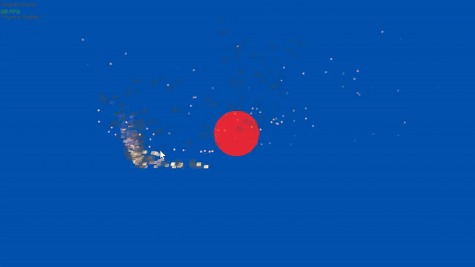

# Particle System for Realistic 3D Effects

## Overview

This project implements a versatile 3D particle system using [raylib](https://www.raylib.com/). It allows for the creation of realistic effects such as fire, smoke, and embers through customizable particle emitters. The system leverages modern C++ features for performance and ease of use.

## Key Components

### 1. `ParticleSystem`

The `ParticleSystem` class manages multiple `Emitter` objects, orchestrating their updates and rendering.

- **Methods**:
  - `void Register(std::unique_ptr<Emitter> emitter);`  
    Registers an emitter with the system.
  - `void SetOrigin(const Vector3& newOrigin);`  
    Sets a new origin for all emitters in the system.
  - `void Start();`  
    Starts emitting particles.
  - `void Stop();`  
    Stops emitting particles.
  - `void Burst();`  
    Emits a burst of particles from all emitters.
  - `unsigned long Update(float dt);`  
    Updates the state of all particles.
  - `void Draw() const;`  
    Draws all active particles.

### 2. `Emitter`

The `Emitter` class is responsible for generating and managing particles according to the configuration provided.

- **Constructor**:
  - `Emitter(EmitterConfig cfg);`  
    Initializes the emitter with the specified configuration.
- **Methods**:
  - `void SetOrigin(const Vector3& newOrigin);`  
    Sets a new origin for the emitter.
  - `void Start();`  
    Starts emitting particles.
  - `void Stop();`  
    Stops emitting particles.
  - `void Burst();`  
    Emits a burst of particles.
  - `unsigned long Update(float dt);`  
    Updates the emitter's particles.
  - `void Draw() const;`  
    Draws all active particles.

### 3. `EmitterConfig`

`EmitterConfig` is a structure that holds the configuration details for an `Emitter`. This includes parameters such as direction, velocity, gravity, and more.

- **Attributes**:
  - `Vector3 direction;`  
    The initial direction in which particles are emitted.
  - `FloatRange velocity;`  
    The range of possible velocities for emitted particles.
  - `FloatRange directionAngle;`  
    The range of angles for randomizing the emission direction in 3D space.
  - `FloatRange velocityAngle;`  
    The range of angles for randomizing the emission velocity direction.
  - `FloatRange offset;`  
    The range of offsets from the origin for initial particle positions.
  - `FloatRange originAcceleration;`  
    The range of acceleration toward the origin.
  - `FloatRange age;`  
    The range of lifespans for particles.
  - `IntRange burst;`  
    The range of particle counts for burst emissions.
  - `size_t capacity;`  
    The maximum number of particles that can be active at one time.
  - `size_t emissionRate;`  
    The rate at which particles are emitted per second.
  - `Vector3 origin;`  
    The initial position from which particles are emitted.
  - `Vector3 externalAcceleration;`  
    External forces applied to particles, such as wind.
  - `Color startColor, endColor;`  
    The color transition for particles from birth to expiration.
  - `BlendMode blendMode;`  
    The blending mode used to render particles.
  - `Model model;`  
    The 3D model used to represent each particle.
  - `float gravity;`  
    Gravity applied to particles, affecting their downward motion.
  - `bool collision;`  
    Whether particles should collide with the ground and bounce.

## Usage Example

Below is a simple example demonstrating how to set up and use the particle system in a raylib application.

```cpp
#include "raylib.h"
#include "ParticleSystem.h"

int main() {
    // Initialization
    InitWindow(800, 600, "Particle System Example");

    // Setup camera
    Camera camera = { 0 };
    camera.position = (Vector3){ 5.0f, 5.0f, 10.0f };
    camera.target = (Vector3){ 0.0f, 2.0f, 0.0f };
    camera.up = (Vector3){ 0.0f, 1.0f, 0.0f };
    camera.fovy = 45.0f;
    camera.type = CAMERA_PERSPECTIVE;

    // Load particle model
    Model particleModel = LoadModelFromMesh(GenMeshSphere(0.1f, 8, 8));

    // Fire Emitter Configuration
    EmitterConfig fireConfig = {
        .direction = { 0.0f, 1.0f, 0.0f },
        .velocity = { 1.0f, 3.0f },
        .directionAngle = { 0.0f, 360.0f },
        .velocityAngle = { 0.0f, 180.0f },
        .offset = { 0.0f, 1.0f },
        .originAcceleration = { 0.1f, 0.5f },
        .age = { 1.0f, 3.0f },
        .burst = { 10, 20 },
        .capacity = 1000,
        .emissionRate = 100,
        .origin = { 0.0f, 0.0f, 0.0f },
        .externalAcceleration = { 0.0f, 0.0f, 0.0f },
        .startColor = RED,
        .endColor = ORANGE,
        .blendMode = BLEND_ALPHA,
        .model = particleModel,
        .gravity = 9.8f,
        .collision = true
    };

    // Create Particle System
    ParticleSystem particleSystem;
    particleSystem.Register(std::make_unique<Emitter>(fireConfig));
    particleSystem.Start();

    while (!WindowShouldClose()) {
        float dt = GetFrameTime();
        particleSystem.Update(dt);

        BeginDrawing();
        ClearBackground(BLACK);
        BeginMode3D(camera);

        particleSystem.Draw();

        EndMode3D();
        EndDrawing();
    }

    UnloadModel(particleModel);
    CloseWindow();
    return 0;
}
```

### Summary

This particle system is designed for flexibility and ease of use, enabling the creation of complex, realistic effects with minimal code. By adjusting the parameters in `EmitterConfig`, you can simulate various environmental effects like fire, smoke, and sparks.
